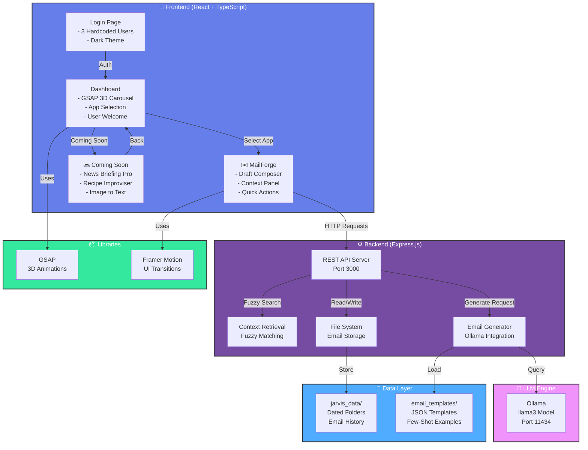
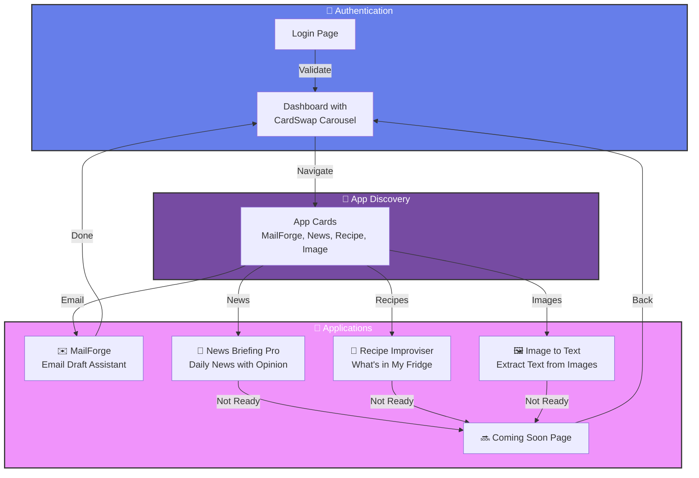
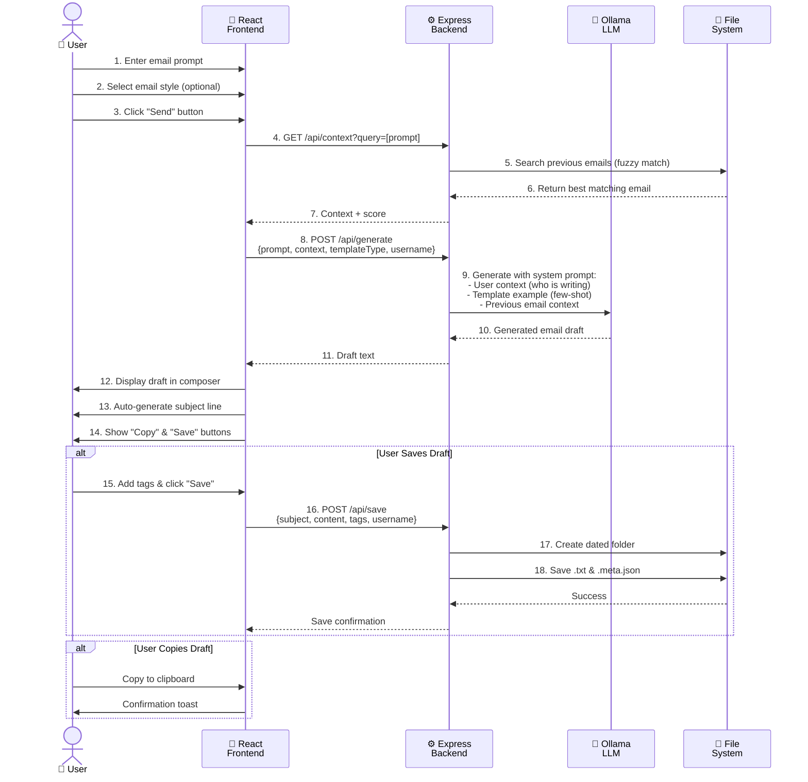
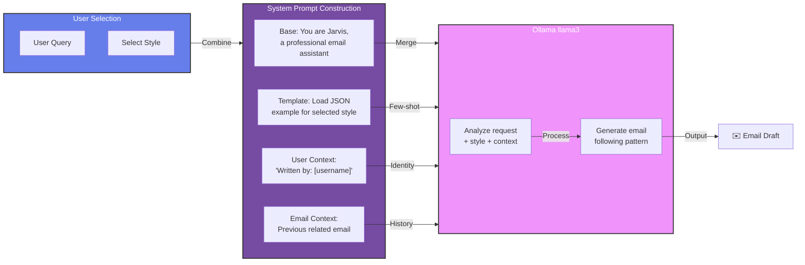
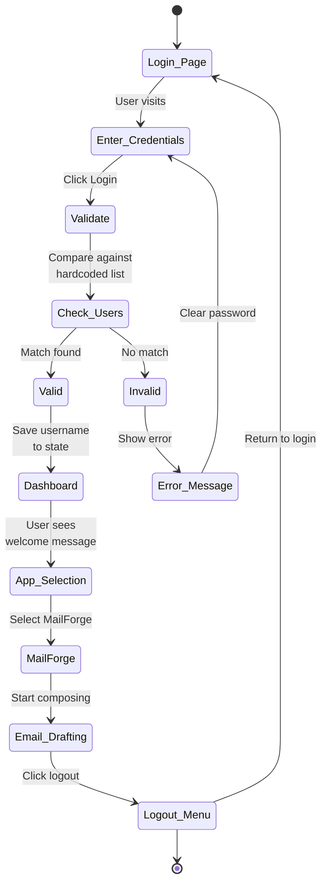

# Jarvis Suite - Multi-App AI Assistant Platform

A sophisticated multi-app platform powered by React, TypeScript, and Ollama LLM with few-shot prompting, context retrieval, and user authentication. Jarvis Suite helps professionals through **MailForge** (email drafting) and upcoming apps like News Briefing Pro, Recipe Improviser, and Image to Text Generator.

## 📋 Table of Contents

1. [Architecture Overview](#architecture-overview)
2. [Features](#features)
3. [System Design](#system-design)
4. [Project Structure](#project-structure)
5. [Authentication System](#authentication-system)
6. [Email Generation Pipeline](#email-generation-pipeline)
7. [API Endpoints](#api-endpoints)
8. [Configuration](#configuration)
9. [Deployment](#deployment)
10. [User Accounts](#user-accounts)
11. [FAQ](#faq)

---

## Architecture Overview

### High-Level System Architecture



---

## Features

### 🎨 Dashboard & App Selection
- **Animated App Carousel** using GSAP for smooth 3D card transitions
- **Responsive Card Display** (400x320px) with glass-morphism design
- **Manual Navigation** with arrow buttons (← | →)
- **Linear Animation** for instant, crisp transitions
- **Click-to-Open** apps with smooth navigation

### 🔐 Authentication
- **3 Pre-configured User Accounts** with secure login
- Dark theme login interface with glass-morphism design
- Session-based authentication (frontend state management)

### ✉️ MailForge - Email Generation
- **AI-Powered Drafts** using Ollama LLM (llama3 model)
- **Few-Shot Prompting** with 5 email templates:
  - Meeting Request
  - Follow-up
  - Project Proposal
  - Status Update
  - Urgent Issue
- **Template Style Selection** dropdown for context-aware generation

### 📚 Context Retrieval
- **Fuzzy Matching** against previous emails (70%+ similarity threshold)
- **Smart Context Panel** showing related emails
- Scores displayed for relevance feedback
- **User-Aware Context** - includes logged-in user information in prompts

### 💾 Email Management
- **Save Drafts** with custom tags
- **Calendar View** showing email history by date
- **Search Functionality** by date, tags, and keywords
- **Tag-Based Organization** for quick filtering

### 🎯 Upcoming Apps (Coming Soon)
1. **News Briefing Pro** - Daily news with opinion twist
2. **Recipe Improviser** - Find recipes based on ingredients in your fridge
3. **Image to Text** - Extract text from images

### 🎨 UI/UX
- **Dark Theme** across all pages with glass-morphism
- **Motion Animations** for smooth transitions (GSAP + Framer Motion)
- **Responsive Design** (mobile, tablet, desktop)
- **Quick Actions** panel with preset email styles

---

## Dashboard & App Carousel

### CardSwap Component with GSAP

The dashboard features an animated 3D card carousel built with **GSAP 3D transforms**:

**Key Features:**
- 🔄 Smooth 3D card stack animation
- ⚡ Linear easing for instant, crisp transitions (0.4s per animation)
- 🖱️ Manual navigation with left/right arrow buttons
- 📱 Responsive sizing (400x320px cards)
- 🎯 Click cards to open apps
- 🎨 Glass-morphism design with backdrop blur

**CardSwap Props:**
```typescript
<CardSwap
  width={400}                    // Card width
  height={320}                   // Card height
  cardDistance={50}              // Horizontal spacing
  verticalDistance={60}          // Vertical spacing (stack depth)
  easing="linear"                // Animation easing (linear, power1.inOut, elastic)
  autoRotate={false}             // Disable auto-rotation
  pauseOnHover={false}           // Disable pause on hover
  onCardClick={(index) => {}}    // Click handler
/>
```

**Animation Types:**
- `linear` - Fast, crisp transitions (0.4s)
- `power1.inOut` - Smooth easing (0.8s)
- `elastic` - Bouncy transitions with spring effect (2s)

### App Navigation

Users can navigate between apps by:
1. **Clicking left/right arrow buttons** - Manual control
2. **Clicking a card directly** - Opens the app immediately
3. **Back button** in Coming Soon pages - Returns to dashboard

---

## System Design

### Application Flow



### Email Generation Flow



### Email Style Selection & Few-Shot Prompting



---

## Project Structure

```
jarvis/
├── src/
│   ├── components/
│   │   ├── Login.tsx              # Authentication page
│   │   ├── Dashboard.tsx          # Multi-app selection with GSAP carousel
│   │   ├── CardSwap.tsx           # GSAP-powered 3D card carousel component
│   │   ├── ComingSoon.tsx         # Coming Soon page for future apps
│   │   └── Calendar.tsx           # Email history calendar view
│   ├── App.tsx                    # Main router & app dispatcher
│   ├── main.tsx                   # React entry point
│   └── index.css                  # Dark theme + glass-morphism styles
├── email_templates/               # Few-shot example templates
│   ├── meeting_request.json
│   ├── follow_up.json
│   ├── project_proposal.json
│   ├── status_update.json
│   └── urgent_issue.json
├── jarvis_data/                   # Runtime email storage (by date)
│   ├── 2025-04-01/
│   │   ├── email_subject.txt
│   │   └── email_subject.meta.json
│   └── 2025-04-02/
├── server.ts                      # Express backend + Ollama integration
├── vite.config.ts                 # Vite build configuration
├── tsconfig.json                  # TypeScript configuration
├── index.html                     # HTML entry point
├── package.json                   # Dependencies (includes gsap, framer-motion)
└── README.md                      # This file
```

---

## Authentication System

### Login Flow



---

## Email Generation Pipeline

### Context & User Information

**Current Implementation:**
- Context retrieved via fuzzy matching against previous emails
- **Username included** in system prompt so Ollama knows who is writing

**System Prompt Example:**
```
You are Jarvis, a professional email assistant.
Draft a clear, concise, and effective email based on the user's request.

WRITER: [username]
PREVIOUS CONTEXT: [best matching email from history]
EMAIL STYLE EXAMPLE: [template JSON body if style selected]

USER REQUEST: [user query]
```

This ensures:
- ✅ User identity is known to the model
- ✅ Signature/style consistency with previous emails
- ✅ Context-aware responses based on email history

### Template System

**5 Email Templates with Few-Shot Examples:**

Each template (`email_templates/*.json`) contains:
```json
{
  "id": "meeting_request",
  "name": "Meeting Request",
  "category": "professional",
  "description": "Request a meeting or call",
  "subject": "Request for [Time] Meeting",
  "body": "Hi [Recipient],\n\nI wanted to reach out...",
  "variables": ["recipient", "time", "topic"],
  "keywords": ["discuss", "sync", "available", "calendar"]
}
```

When a user selects a style:
1. Template is loaded from JSON
2. Template body added to system prompt as `EXAMPLE EMAIL STYLE:`
3. Ollama generates email following the style pattern
4. Few-shot prompting improves output quality

---

## API Endpoints

### 1. GET `/api/history`
Fetch all saved emails organized by date
```json
Response: [
  {
    "date": "2025-04-03",
    "emails": [
      {
        "name": "meeting request",
        "filename": "meeting_request.txt",
        "tags": ["urgent", "client"]
      }
    ]
  }
]
```

### 2. GET `/api/context?query=<search>`
Fuzzy-match against previous emails to find context
```json
Response: {
  "context": "[previous email matching content]",
  "source": "2025-04-01/follow_up.txt",
  "score": 85
}
```
- Score > 70: Match found
- Score > 95: Very strong match (stops search early)

### 3. POST `/api/generate`
Generate email using Ollama with few-shot prompting
```json
Request: {
  "prompt": "Send a meeting request to John about Q2 planning",
  "context": "[retrieved from /api/context]",
  "templateType": "meeting_request",
  "username": "sandesh"
}

Response: {
  "draft": "[Generated email text]"
}
```

### 4. POST `/api/save`
Save draft with tags to file system
```json
Request: {
  "subject": "Q2 Planning Meeting",
  "content": "[email content]",
  "tags": ["meeting", "q2"],
  "username": "sandesh"
}

Response: {
  "success": true,
  "path": "2025-04-03/Q2_Planning_Meeting.txt"
}
```

### 5. GET `/api/templates`
List all available email templates
```json
Response: [
  {"id": "meeting_request", "name": "Meeting Request"},
  {"id": "follow_up", "name": "Follow Up"}
]
```

### 6. POST `/api/templates/apply`
Fill template variables
```json
Request: {
  "templateId": "meeting_request",
  "variables": {"recipient": "John", "time": "Tuesday"}
}

Response: {
  "subject": "Request for Tuesday Meeting",
  "body": "[filled template]"
}
```

### 7. GET `/api/search?date=<YYYY-MM-DD>&tag=<tag>&keyword=<keyword>`
Advanced search with filters
```json
Response: [
  {
    "date": "2025-04-03",
    "emails": [...]
  }
]
```

---

## Dependencies

### Frontend Libraries
```json
{
  "react": "Latest",
  "typescript": "Latest",
  "vite": "Latest",
  "gsap": "^3.x",                    // 3D Card animations
  "framer-motion": "Latest",         // UI Transitions
  "lucide-react": "Latest",          // Icons
  "clsx": "Latest"                   // Utility for className
}
```

**Key Packages:**
- **gsap** - GSAP 3D transforms for CardSwap carousel animations
- **framer-motion** - Smooth React animations for UI transitions
- **axios** - HTTP client for API requests
- **lucide-react** - Beautiful SVG icon set

### Backend Libraries
- **Express.js** - REST API server
- **Node.js** - Runtime environment
- **Ollama SDK** - LLM integration

---

## Configuration

### Environment Setup

#### Requirements
- **Node.js** 18+
- **Ollama** running locally (http://localhost:11434)
- **npm** or **yarn**

#### Install Dependencies
```bash
npm install
```

Installs all required packages including:
- `gsap` for card carousel animations
- `framer-motion` for smooth UI transitions
- `axios` for API communication

#### Start Ollama
```bash
# Ensure Ollama is running
ollama serve

# In another terminal, pull the llama3 model (if not already present)
ollama pull llama3
```

#### Run Development Server
```bash
npm run dev
# Frontend: http://localhost:5173
# Backend: http://localhost:3000
```

#### Build for Production
```bash
npm run build
```

### Key Configuration Files

**vite.config.ts** - Proxies backend requests
```typescript
proxy: {
  '/api': {
    target: 'http://localhost:3000',
    changeOrigin: true,
  }
}
```

**tsconfig.json** - TypeScript strict mode enabled

**index.css** - Dark theme (Tailwind CSS + custom utilities)
- `.glass` - Glass-morphism effect
- Dark mode support with Tailwind

---

## Deployment

### Local Development
```bash
npm run dev
# Access: http://localhost:5173
# API: http://localhost:3000
```

### Production Build
```bash
npm run build
npm run preview
```

### Cloudflare Tunnel Setup

To expose Jarvis publicly via `sidzy.in` using Cloudflare Tunnel:

```bash
# 1. Install Cloudflare Tunnel agent (cloudflared)
# https://developers.cloudflare.com/cloudflare-one/connections/connect-apps/install-and-setup/

# 2. Create tunnel
cloudflared tunnel create jarvis

# 3. Configure tunnel (~/.cloudflare/config.yml or via CLI)
# Point sidzy.in to http://localhost:3000

# 4. Start tunnel
cloudflared tunnel run jarvis
```

**CORS Handling with Cloudflare:**
- ✅ **No CORS Issues** - Requests go through same tunnel domain
- ✅ Backend already has `cors()` middleware enabled
- ✅ All API requests proxied through Vite dev server (same origin)
- ✅ Production: Both frontend & backend served from same domain

The tunnel provides origin isolation, so CORS headers won't be needed when everything is served from `sidzy.in`.

---

**User-Specific Behavior:**
- Each user's username is included in email generation prompts
- Email drafts are tagged with user context
- Saved emails accumulate user history for context matching

---

## FAQ

### Q1: What information does the model receive about the user writing the email?

**A:** The system includes:
- **Username** in the system prompt (e.g., "WRITER: sandesh")
- **Previous emails** from that user (via context retrieval)
- **Email style preferences** (selected from 5 templates)

This allows the LLM to:
- Maintain consistent tone/style across emails
- Reference previous communications
- Use user-specific professional language
- Generate contextually appropriate responses

The username is **automatically passed** to the backend with each generation request, so you don't need to manually specify it.

### Q2: How does the Dashboard card carousel work?

**A:** The Dashboard uses **GSAP 3D transforms** for smooth animations:
- **CardSwap Component** manages card stacking and animations
- **Manual Navigation:** Click left/right arrow buttons to cycle through apps
- **Animation Easing:** Linear (0.4s) for instant transitions
- **3D Depth:** Cards stack with perspective for depth effect
- **Click-to-Open:** Click any card to open that app
- **Responsive:** Works seamlessly on all screen sizes

The carousel is fully controlled via API:
```typescript
cardSwapRef.current?.next()  // Trigger animation to next card
```

### Q3: How do I add a new app to the Dashboard?

**A:**
1. Create new component in `src/components/` (e.g., `MyApp.tsx`)
2. Add to apps array in `Dashboard.tsx`:
```typescript
const apps = [
  // ... existing apps ...
  {
    id: 'my-app',
    name: 'My New App',
    description: 'App description',
    icon: IconName,
    color: 'from-color/20 to-color/10',
  }
];
```
3. Handle routing in `App.tsx`:
```typescript
if (currentApp === 'my-app') {
  return <MyApp onBack={handleBackToDashboard} />;
}
```
4. Card automatically appears in carousel!

### Q4: Can I customize the card animation?

**A:** Yes! Tweak these props in `Dashboard.tsx`:
```typescript
<CardSwap
  cardDistance={50}       // Horizontal spacing (↔️)
  verticalDistance={60}   // Vertical depth (↕️)
  easing="linear"         // linear | power1.inOut | elastic
  width={400}            // Card width
  height={320}           // Card height
/>
```

**Easing Options:**
- `linear` - Fast & crisp (0.4s per animation)
- `power1.inOut` - Smooth easing (0.8s)
- `elastic` - Bouncy spring effect (2s)

### Q5: What if Ollama is not running?

**A:** Backend returns error:
```json
{
  "error": "Ollama not reachable. Ensure it is running locally.",
  "isFallback": true
}
```

Frontend displays: "MailForge encountered an error. Please try again."

### Q6: How does context retrieval work?

**A:** 
1. User enters email prompt (e.g., "Send follow-up to client")
2. Frontend sends: `GET /api/context?query=send%20follow%20up`
3. Backend searches previous emails using **fuzzy matching** (fuzzball library)
4. Files matching > 70% similarity are candidates
5. Best match returned with relevance score (0-100)
6. Context + prompt sent to Ollama for generation

This means drafts are influenced by email history, creating consistent style.

### Q7: Will CORS cause issues when tunneling via Cloudflare?

**A:** **No, CORS won't be an issue.**

Here's why:
- **Current Setup:** Vite dev server proxies `/api` requests to backend (same origin during dev)
- **With Cloudflare Tunnel:** Both frontend and backend are served from `sidzy.in` domain
- **Backend Protection:** Express already has `cors()` middleware enabled
- **Result:** All requests appear to come from the same origin

No additional CORS configuration needed. The tunnel essentially creates a unified domain namespace.

### Q8: Can I modify the templates?

**A:** Yes! Templates in `email_templates/*.json` are plain JSON:
1. Edit existing template or create new one
2. Reload the app (no restart needed, templates loaded on each request)
3. New template appears in "Email Style" dropdown
4. Ollama uses it as few-shot example in system prompt

### Q9: Where are emails stored?

**A:** 
- **Location:** `jarvis_data/` folder (created automatically)
- **Structure:** `jarvis_data/YYYY-MM-DD/email_subject.txt`
- **Metadata:** `jarvis_data/YYYY-MM-DD/email_subject.meta.json` (tags, timestamp)
- **Persistent:** Survives server restarts

### Q10: How do I backup emails?

**A:** 
```bash
# Simple: zip the jarvis_data folder
zip -r jarvis_backup.zip jarvis_data/

# Or use any cloud sync (Google Drive, OneDrive, etc.)
```

### Q11: Can I use a different LLM model ?

**A:** Yes, modify `server.ts`:
```typescript
const response = await axios.post('http://localhost:11434/api/generate', {
  model: 'mistral',  // Change this line
  prompt: systemPrompt,
  stream: false
})
```

Available Ollama models: `ollama pull [model_name]`

---

## Technology Stack

| Layer | Technology | Purpose |
|-------|------------|---------|
| **Frontend** | React 19 + TypeScript | UI/UX composition |
| **Styling** | Tailwind CSS + Motion | Responsive dark theme + animations |
| **Backend** | Express.js | REST API server |
| **LLM** | Ollama (llama3) | Email generation |
| **Build** | Vite | Fast bundling & dev server |
| **Search** | Fuzzball | Fuzzy matching for context |
| **Date Handling** | date-fns | Date formatting |

---

## License

Educational project - Jarvis Email Assistant Suite

---

## Support & Troubleshooting

### Common Issues

| Issue | Solution |
|-------|----------|
| **"Ollama not reachable"** | Ensure Ollama is running: `ollama serve` |
| **Login fails** | Check username/password against demo accounts |
| **CORS errors** | Ensure `cors()` middleware enabled in server.ts |
| **Missing jarvis_data folder** | Auto-created on first save; check file permissions |
| **Vite proxy not working** | Restart dev server: `npm run dev` |
| **Memory issues** | Reduce Ollama context window in server.ts if needed |

---

## Future Enhancements

- [ ] Database backend (PostgreSQL/MongoDB)
- [ ] Multi-user authentication with JWT tokens
- [ ] Email sending integration (SMTP)
- [ ] More LLM model options
- [ ] Email scheduling
- [ ] A/B testing for email variations
- [ ] Analytics dashboard
- [ ] Mobile app (React Native)

---

**Built with 💜 for efficient email drafting**
